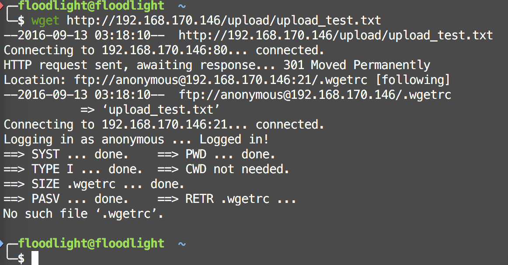
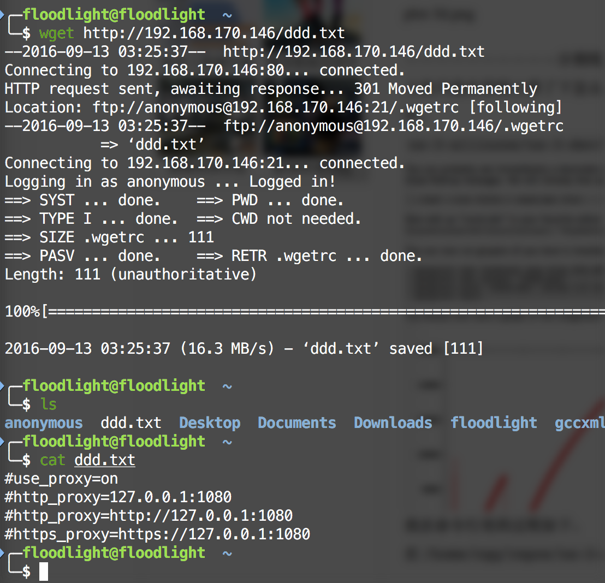

# Wget Arbitrary File Upload Vulnerability Exploit

ftp服务器的ftp服务器根目录`/frv/ftp`下缺少`.wgetrc`文件时，不能完成。
 
加上所需要的`.wgetrc`文件之后，
 
source: 
http://legalhackers.com/advisories/Wget-Arbitrary-File-Upload-Vulnerability-Exploit.html
